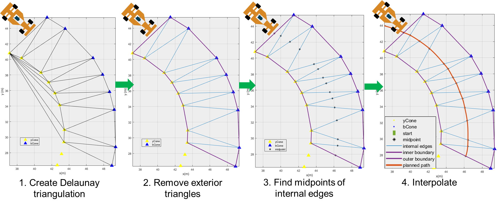

# 基于 Delaunay 三角剖分的 FSAE 路径规划算法

本项目 fork 自 MathWorks 博客文章 [*Path Planning for Formula Student Driverless Cars Using Delaunay Triangulation*](https://blogs.mathworks.com/student-lounge/2022/10/03/path-planning-for-formula-student-driverless-cars-using-delaunay-triangulation/?from=cn)，原作者为 Tanya Kuruvilla。

对原博客进行了代码片段整合、文档注释翻译、优化代码、提取算法至独立函数等工作。

## 文件结构

完整文档、原版博客提供的交互式脚本（`.mlx`）位于 [docs](docs/) 目录下。

- [FSAE-PathPlanning-Delaunay.md](docs/FSAE-PathPlanning-Delaunay.md) - 包含详细讲解的完整文档

所有代码及测试用数据位于 [src](src/) 目录下，建议以该目录作为 MATLAB 工作空间目录。

- [cone_position_data.csv](src/cone_position_data.csv) - 用于测试算法的锥桶位置信息
- [delaunayPathPlanning.m](src/delaunayPathPlanning.m) - 主要脚本（与文档直接对应）
- [pathPlanPlot.m](src/pathPlanPlot.m) - 用于动态绘制路径规划图像的函数
