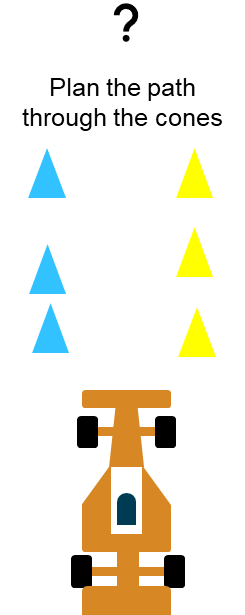
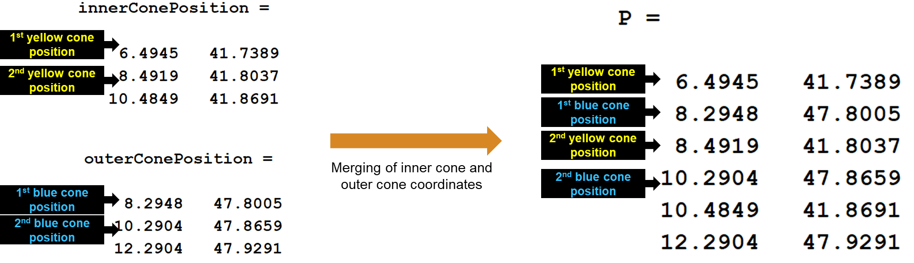
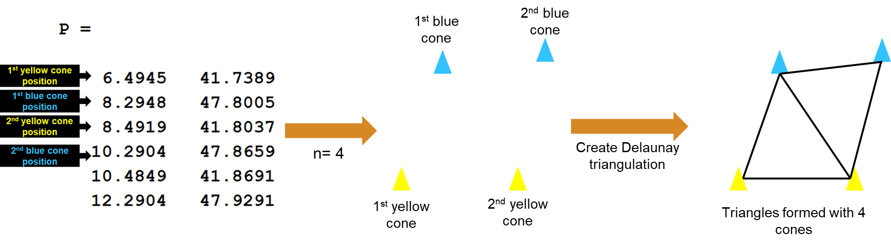
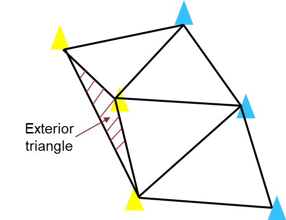
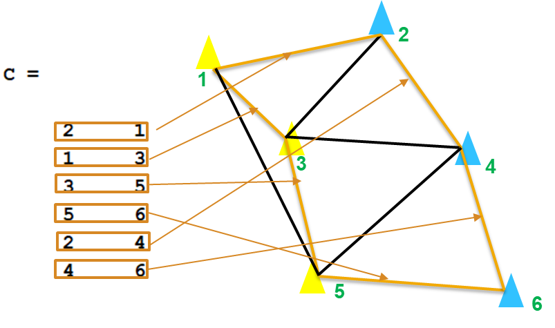
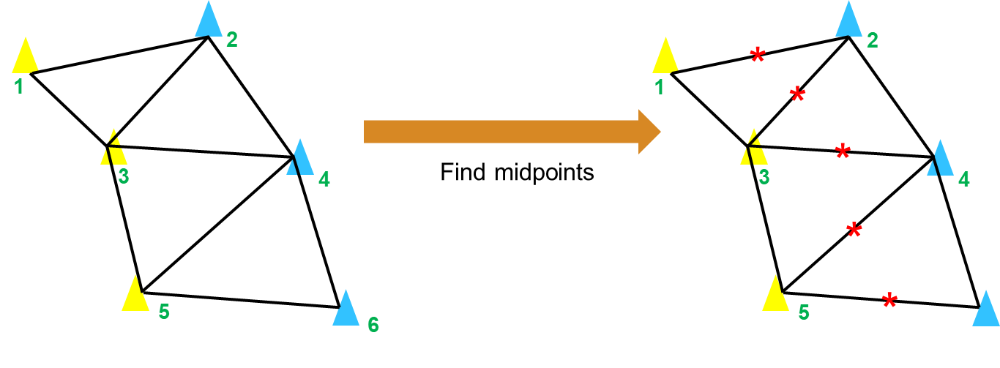
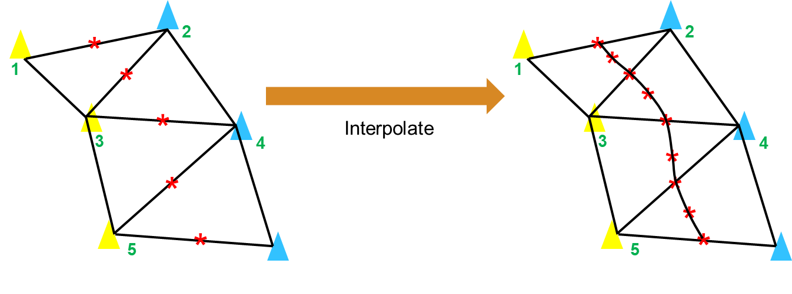

# 基于 Delaunay 三角剖分的 FSAE 路径规划算法（MATLAB实现）

> 本文为项目 [FSAE-PathPlanning-Delaunay](https://github.com/muziing/FSAE-PathPlanning-Delaunay) 之文档，完整代码见 <https://github.com/muziing/FSAE-PathPlanning-Delaunay>

## 引言

在 FSAE（大学生方程式赛车）无人车比赛中，赛车需要根据传感器返回的作为路径边界标识的交通锥桶的信息（颜色、位置坐标），进行路径规划，进而为下一刻的控制提供依据。良好的路径规划算法应能够根据离散的锥桶坐标，快速规划出一条光滑、连续、合理靠近车道中心线的目标路径。



本文介绍了一种基于 Delaunay 三角剖分的路径规划算法：将锥桶位置视为离散点，构建 Delaunay 三角，然后以位于车道内部的那些三角形边的中点为依据进行插值，最终得到期望路径。经验证，该算法基本可以完成路径规划任务。


## 背景知识：Delaunay三角剖分

## 创建Delaunay三角剖分

### 读取加载数据

首先从 CSV 文件中导入锥桶位置坐标。

CSV 数据示例如下，

```csv
num,type,x_coor,y_coor
1,2,8.29483356036796,47.8005083348189
2,2,10.2903642978411,47.8659036790991
3,2,12.2903853701921,47.9291209919643
...
152,11,6.49447171658257,41.7389113024907
153,11,8.49189149682204,41.8037451937836
154,11,10.4848751821667,41.8690573815958
...
```

- 第一列为锥桶序号，内外侧锥桶已经分别按照赛道顺序排序
- 第二列为锥桶类型（颜色），`2` 为外侧锥桶（蓝色，位于车辆行驶方向的左侧）、`11` 为内侧锥桶（黄色，位于车辆行驶方向的右侧）
- 第三四列为 x 坐标与 y 坐标，单位为 [m]

编写 MATLAB 代码读取数据：

```matlab
%% 加载锥桶坐标数据
conePosTable = readtable("cone_position_data.csv");
innerIndex = conePosTable.type == 11;
innerConePosition = [conePosTable(innerIndex, "x_coor"), ...
                         conePosTable(innerIndex, "y_coor")];
outerIndex = conePosTable.type == 2;
outerConePosition = [conePosTable(outerIndex, "x_coor"), ...
                         conePosTable(outerIndex, "y_coor")];
```

此时已将内、外侧锥桶的xy位置坐标分别存储在 `innerConePosition` 与 `outerConePosition` 两张 table 中。

### 数据预处理

然后需要将内外侧锥桶的坐标交替合并，得到将用于创建 `delaunayTriangulation` 对象的 `P` 矩阵。



```matlab
%% 数据预处理
[m, nc] = size(innerConePosition); % 内/外侧锥桶位置数据的size
P = zeros(2 * m, nc); % 初始化由内侧坐标与外侧坐标组成的 P 矩阵
% 将内外侧坐标交替合并
P(1:2:2 * m, :) = innerConePosition.Variables;
P(2:2:2 * m, :) = outerConePosition.Variables;
```

在真实场景中，安装在赛车上的传感器的感知范围是有限的，并不能一次获取所有锥桶位置。因此，设计一个变量 `interval`，用于控制每次规划时考虑的锥桶数量。（换言之，将整条赛道划分为若干个路段，每次只在一个路段内进行规划。）如图所示，若 `interval = 4`，则将基于每 4 个锥桶坐标创建 Delaunay 三角剖分。



```matlab
interval = 10; % 每次规划时考虑的路段长度
interpolationNum = 100; % 插值点数量
pathCount = idivide(uint16(2 * m), interval, 'floor') * interpolationNum; % 最终规划路径坐标点个数
xPos = zeros(1, pathCount); % 数值向量 xPos，用于每次迭代后存储规划的 x 坐标
yPos = zeros(1, pathCount); % 数值向量 yPos，用于每次迭代后存储规划的 y 坐标
```

### 构建三角形

用一个 for 循环控制，每次循环中进行一个路段的路径规划，循环完成后即完成整条赛道的路径规划：

```matlab
for i = interval:interval:2 * m
    % 在每次循环中进行一个路段的路径规划，路段区间长度由interval控制
    %% 构建 Delaunay 三角形
    pointIndex = ((abs((i - 1) - interval)):i); % 属于该局部路段的点集的索引
    delaTria = delaunayTriangulation(P(pointIndex, :)); % 为该路段的点集创建 Delaunay 三角剖分
    delaTriaPoints = delaTria.Points; % 顶点坐标
    [mc, ~] = size(delaTriaPoints); % size

    figure(1) % 绘制 Delaunay 三角剖分
    triplot(delaTria, 'k')
    grid on
    ax = gca;
    ax.GridColor = [0, 0, 0]; % [R, G, B]
    xlabel('x(m)')
    ylabel('y (m)')
    set(gca, 'Color', '#EEEEEE')
    title('Delaunay Triangulation')
    hold on
```

## 移除外部三角形

在进行三角剖分时，对于曲率比较大的弯道，可能会创建出落在赛道之外的三角形，进而导致后续产生错误的路径。因此需要通过施加约束边界 `C` 去除这些外部三角形。



### 定义约束

约束边界 `C` 是一个由约束边的顶点 ID 所组成的两列矩阵，它的每一行对应一条约束边，其中：

- `C(j, 1)` 为第 j 条约束边起始顶点的 ID
- `C(j, 2)` 为第 j 条约束边末端顶点的 ID



通过如下代码生成约束边界矩阵 `C`：

```matlab
    %% 移除外部三角形
    if rem(interval, 2) == 0
        % 当区间为偶数时的内外侧约束
        cIn = [2, 1; (1:2:mc - 3)', (3:2:(mc))'; (mc - 1), mc];
        cOut = [(2:2:(mc - 2))', (4:2:mc)'];
    else
        % 区间为奇数时的内外侧约束
        cIn = [2, 1; (1:2:mc - 2)', (3:2:(mc))'; (mc - 1), mc];
        cOut = [(2:2:(mc - 2))', (4:2:mc)'];
    end

    C = [cIn; cOut]; % 创建一个连接约束边界的矩阵
```

### 创建带有约束的 Delaunay 三角剖分

## 获取中点与平滑处理

### 获取内部边中点

如下图所示，寻找所有位于车道内部的三角形边的中点，连接这些中点即为初步规划出的路径：



```matlab
    %% 寻找内边中心点
    xPoints = sortedTria.Points(:, 1);
    yPoints = sortedTria.Points(:, 2);

    E = edges(sortedTria); % 三角剖分边缘
    isEven = rem(E, 2) == 0; % 忽略边界边缘
    Eeven = E(any(isEven, 2), :);
    isOdd = rem(Eeven, 2) ~= 0;
    Eodd = Eeven(any(isOdd, 2), :);

    xMidpoints = ((xPoints((Eodd(:, 1))) + xPoints((Eodd(:, 2)))) / 2); % x 中点坐标
    yMidpoints = ((yPoints((Eodd(:, 1))) + yPoints((Eodd(:, 2)))) / 2); % y 中点坐标
    PMidpoints = [xMidpoints, yMidpoints]; % 中点坐标
```

### 中心点插值

最后，为了使获得的路径足够光滑，还需要在中心点之间进行插值：



```matlab
    %% 中心点插值
    distancematrix = squareform(pdist(PMidpoints));
    distancesteps = zeros(length(PMidpoints) - 1, 1);

    for j = 2:length(PMidpoints)
        distancesteps(j - 1, 1) = distancematrix(j, j - 1);
    end

    totalDistance = sum(distancesteps); % 总经过距离
    distbp = cumsum([0; distancesteps]); % 每个路径点间的距离
    gradbp = linspace(0, totalDistance, interpolationNum); % 线性间距向量
    xq = interp1(distbp, xMidpoints, gradbp, 'spline'); % 插值 x 坐标
    yq = interp1(distbp, yMidpoints, gradbp, 'spline'); % 插值 y 坐标

    startCount = (i / interval - 1) * interpolationNum + 1;
    endCount = i / interval * interpolationNum;
    xPos(:, startCount:endCount) = xq; % 在每次迭代后存储获得的 x 中点
    yPos(:, startCount:endCount) = yq; % 在每次迭代后存储获得的 y 中点
```

## 期望路径可视化

对最终规划结果进行可视化：

```matlab
    figure(3) % 动态绘制路径规划
    % 用于展示规划路径全貌的子图
    pos1 = [0.1, 0.15, 0.5, 0.7];
    subplot('Position', pos1)
    pathPlanPlot(innerConePosition, outerConePosition, ...
        P, delaTria, sortedTria, xMidpoints, yMidpoints, cIn, cOut, xq, yq)
    title(['Path planning based on constrained Delaunay' ...
               newline ' triangulation'])

    % 用于展示规划路径局部细节的子图
    pos2 = [0.7, 0.15, 0.25, 0.7];
    subplot('Position', pos2)
    pathPlanPlot(innerConePosition, outerConePosition, ...
        P, delaTria, sortedTria, xMidpoints, yMidpoints, cIn, cOut, xq, yq)
    xlim([min(min(xPoints(1:2:(mc - 1)), xPoints(2:2:mc))) ...
              max(max(xPoints(1:2:(mc - 1)), xPoints(2:2:mc)))])
    ylim([min(min(yPoints(1:2:(mc - 1)), yPoints(2:2:mc))) ...
              max(max(yPoints(1:2:(mc - 1)), yPoints(2:2:mc)))])

end
```

其中 `pathPlanPlot()` 函数代码如下：

```matlab
% 动态绘图函数
function [] = pathPlanPlot(innerConePosition, outerConePosition, P, DT, TO, xmp, ymp, cIn, cOut, xq, yq)

    plot(innerConePosition.x_coor, innerConePosition.y_coor, '.b', 'MarkerFaceColor', 'b')
    hold on
    plot(outerConePosition.x_coor, outerConePosition.y_coor, '.r', 'MarkerFaceColor', 'r')
    plot(P(1, 1), P(1, 2), '|', 'MarkerEdgeColor', '#F57F4B', 'MarkerSize', 15, 'LineWidth', 5)
    grid on
    ax = gca;
    ax.GridColor = [0, 0, 0]; % [R, G, B]
    xlabel('x(m)')
    ylabel('y (m)')
    set(gca, 'Color', '#EEEEEE')

    hold on
    plot(xmp, ymp, '*k')
    drawnow

    hold on
    triplot(TO, 'Color', '#00AAAA') % 三角网格
    drawnow

    hold on
    plot(DT.Points(cOut', 1), DT.Points(cOut', 2), ...
        'Color', '#E54E5D', 'LineWidth', 2) % 左侧红锥桶边界线
    plot(DT.Points(cIn', 1), DT.Points(cIn', 2), ...
        'Color', '#037CD2', 'LineWidth', 2) % 右侧蓝锥桶边界线
    drawnow

    hold on
    plot(xq, yq, 'Color', '#927FD3', 'LineWidth', 2.5) % 期望路径
    drawnow

end
```
